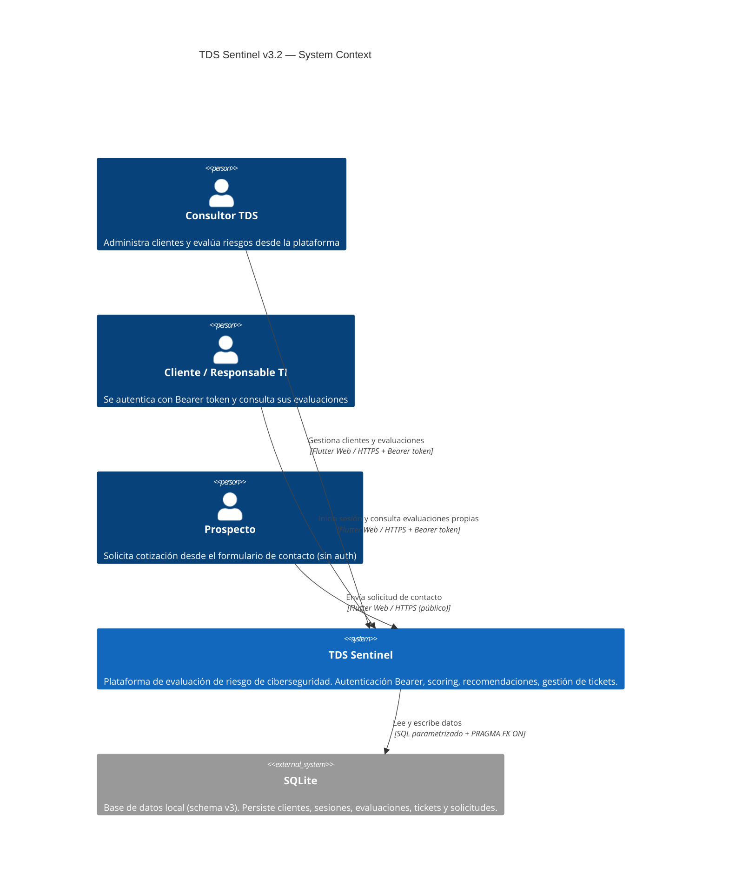
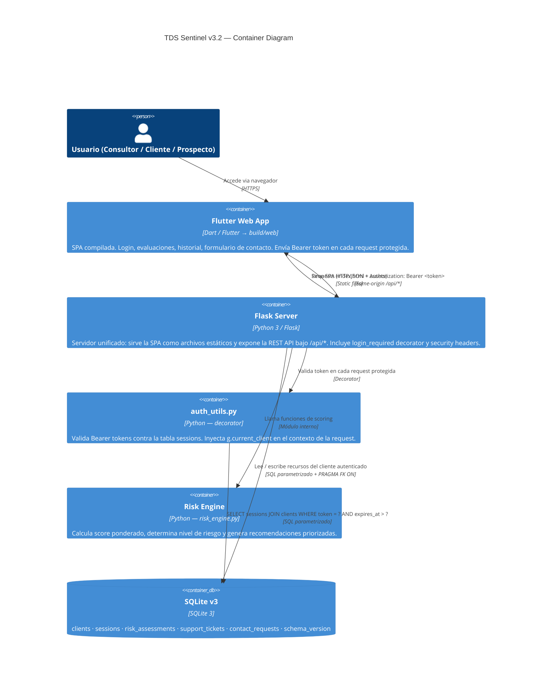

# TDS Sentinel — System Context (v3.2.0)

## Descripción del sistema

TDS Sentinel evalúa el nivel de riesgo de ciberseguridad de organizaciones mediante cuestionarios de controles ponderados (Assessment Packs). El resultado es un score numérico, un nivel de riesgo y recomendaciones priorizadas.

A partir de **v3.1**, el sistema requiere autenticación Bearer token en todos los endpoints sensibles. Cada cliente solo puede acceder a sus propios recursos (evaluaciones y perfil). Flask actúa como servidor unificado que sirve tanto la SPA Flutter Web como la REST API.

---

## Diagrama de contexto

---

## Diagrama de contenedores

---

## Decisiones de arquitectura

### ¿Por qué Flask sirve la SPA Flutter Web?

En v3, Flask actúa como servidor unificado eliminando la necesidad de un servidor web separado (nginx, etc.) para el MVP:

- Un solo proceso, un solo puerto (5000).
- Sin problemas de CORS en producción — las requests son same-origin.
- Codespaces expone el puerto 5000 con HTTPS automático.
- Rutas no-API devuelven `index.html` para soportar el router de Flutter Web.

Para producción a escala, la separación nginx + gunicorn sigue siendo la arquitectura recomendada.

### ¿Por qué Bearer token y no JWT?

El MVP usa tokens opacos de 32 bytes URL-safe (`secrets.token_urlsafe(32)`) almacenados en la tabla `sessions`:

- **Revocación inmediata**: un `DELETE FROM sessions WHERE token = ?` invalida el token al instante (logout activo). Con JWT stateless esto no es posible sin una blocklist.
- **Visibilidad de sesiones**: la tabla `sessions` registra `created_at`, `expires_at` y `client_id` — trazabilidad de acceso sin complejidad adicional.
- **Simplicidad**: no requiere librerías de criptografía asimétrica ni manejo de refresh tokens en el MVP.
- **Seguridad ante auto-lockout**: `get_client_by_token()` verifica simultáneamente expiry Y `client_status = 'enabled'` — un cliente bloqueado pierde acceso de inmediato sin esperar expiración.

Para producción con múltiples instancias, JWT + Redis blocklist o sesiones distribuidas sería preferible.

### ¿Por qué ownership enforcement y no roles admin?

En el MVP todos los usuarios son equivalentes — no hay rol administrador. Las reglas de acceso son:

1. Un cliente solo puede leer/escribir sus propios recursos.
2. `client_status` (enabled/blocked/disabled) solo es modificable directamente en DB — no hay endpoint de admin en el MVP.
3. `GET /clients` retorna solo el perfil propio, no todos los clientes.

Esto cierra los vectores IDOR sin necesidad de un sistema de roles más complejo.

### ¿Por qué Assessment Packs en código?

Para el MVP, los packs viven en `risk_engine.py` como diccionarios Python:

- Simplifica el desarrollo inicial y elimina migraciones de datos.
- Permite iterar rápido sobre preguntas y pesos.
- La interfaz pública del módulo (`get_pack_by_id`, `calculate_risk_score`) permite mover los packs a una tabla `assessment_packs` sin cambios en las rutas.

### ¿Por qué SQLite?

- Sin dependencias externas de servidor.
- Suficiente para un MVP con carga baja (1 escritura a la vez con WAL mode).
- Schema versionado (`schema_version`) con migraciones automáticas desde v1.x/v2.x.
- `PRAGMA journal_mode = WAL` mejora la concurrencia de lectura.
- Path de migración a PostgreSQL trazado: queries parametrizadas compatibles, sin ORM.

### ¿Por qué SHA-256 + salt para contraseñas?

`hash_password()` en `database.py` usa `secrets.token_hex(16)` como salt y `hashlib.sha256` para el digest. El salt se almacena junto al hash (`salt:digest`):

- Cada contraseña tiene un salt único → mismo password da hashes distintos.
- `secrets.compare_digest` previene timing attacks en la verificación.
- Para producción real se recomienda migrar a `bcrypt` o `argon2`.

### ¿Por qué SHA-256 en `assessment_hash`?

`assessment_hash` es un hash de integridad, no de seguridad de contraseña:
- Verifica que el registro no fue alterado post-creación.
- Sirve como referencia única de la evaluación.
- No usa salt porque su propósito es reproducibilidad, no autenticación.

### ¿Por qué UUIDs v4 para tickets y solicitudes?

En v3.1 se reemplazaron los `ticket_id` y `request_id` enteros por UUIDs v4 (`uuid.uuid4()`):
- Los IDs secuenciales exponen el volumen de tickets al cliente (enumeración de información).
- Un UUID v4 tiene 122 bits de entropía — no enumerable ni predecible.
- La referencia sigue siendo útil para el seguimiento interno sin filtrar información de negocio.

### ¿Por qué `client_status` en clients?

El campo `client_status` (enabled / blocked / disabled) permite:
- Bloquear acceso sin eliminar datos históricos.
- Distinguir cuentas temporalmente bloqueadas (`blocked`) de deshabilitadas permanentemente (`disabled`).
- El check ocurre antes de verificar la contraseña (falla rápido con 403).
- También aplica a tokens activos: `get_client_by_token()` filtra `client_status = 'enabled'`.
