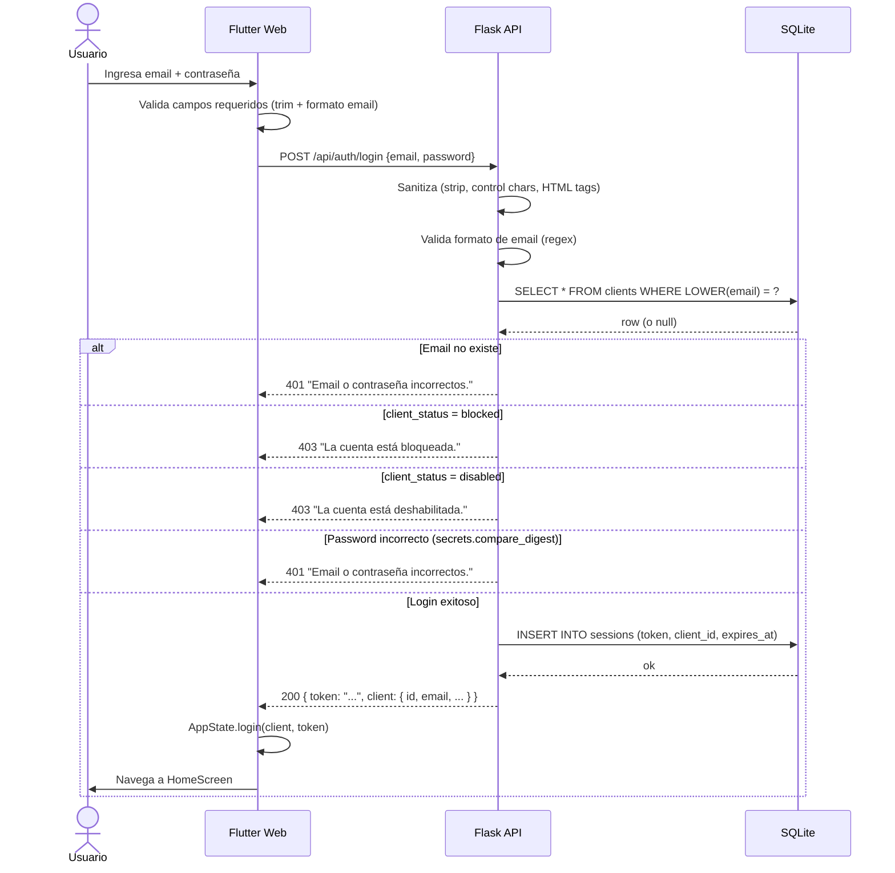
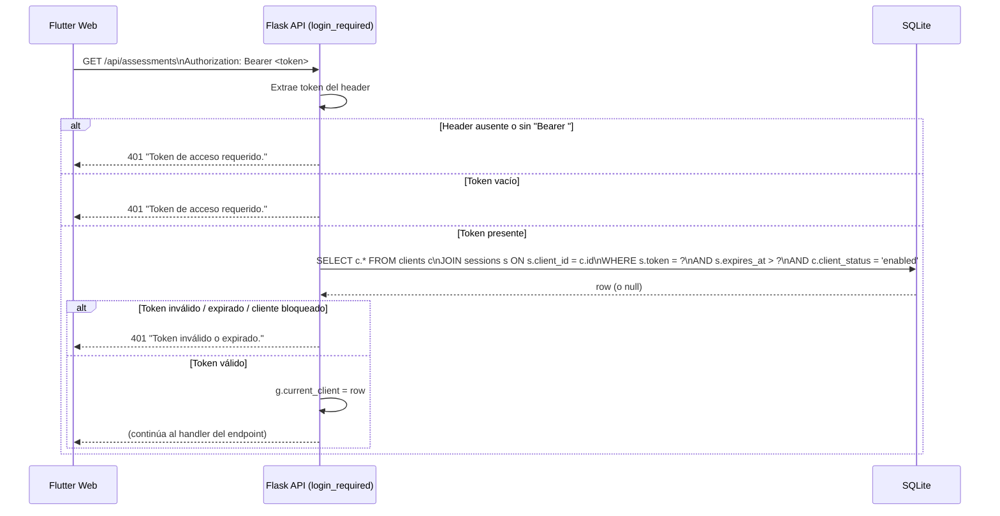
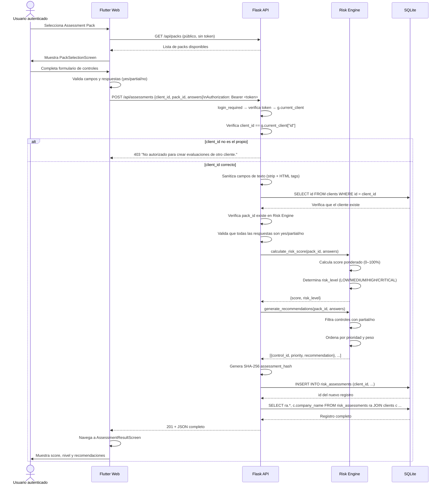
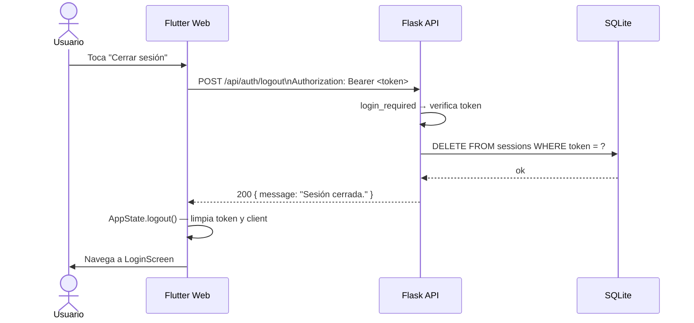
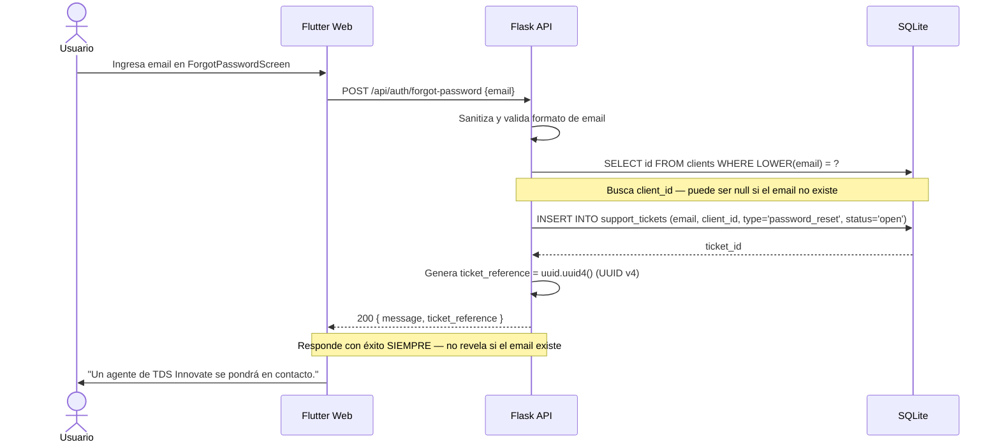
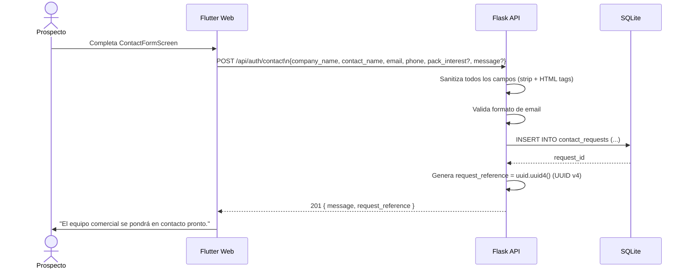

# TDS Sentinel — Flujos de usuario (v3.2.0)

---

## 1. Flujo de autenticación (Bearer token)



---

## 2. Flujo de request autenticada (middleware)



---

## 3. Flujo de evaluación de riesgo



---

## 4. Flujo de logout



---

## 5. Flujo de solicitud de reset de contraseña



---

## 6. Flujo de solicitud de contacto (prospecto)



---

## Lógica de scoring

### Valores de riesgo por respuesta

| Respuesta | Factor de riesgo |
|-----------|-----------------|
| `yes`     | 0.0 × weight |
| `partial` | 0.5 × weight |
| `no`      | 1.0 × weight |

### Pack: Infrastructure Basic Security

| Control     | Peso | Justificación |
|-------------|------|---------------|
| `mfa`       | 25   | Acceso no autorizado es el vector más frecuente |
| `backups`   | 25   | Sin respaldo, un ransomware puede ser catastrófico |
| `antivirus` | 20   | Protección básica de endpoints |
| `firewall`  | 20   | Segmentación y control de red |
| `training`  | 10   | Humanos son el eslabón más débil |
| **Total**   | **100** | |

### Umbrales de nivel de riesgo

| Rango      | Nivel    | Descripción |
|------------|----------|-------------|
| 0% – 25%   | LOW      | Controles bien implementados |
| 26% – 50%  | MEDIUM   | Brechas que atender a corto plazo |
| 51% – 75%  | HIGH     | Vulnerabilidades significativas |
| 76% – 100% | CRITICAL | Acción inmediata requerida |

### Ejemplo de cálculo

```
Respuestas:
  mfa      = yes     → 0.0 × 25 = 0
  backups  = no      → 1.0 × 25 = 25
  antivirus= yes     → 0.0 × 20 = 0
  firewall = partial → 0.5 × 20 = 10
  training = no      → 1.0 × 10 = 10

score_raw     = 45 / 100 = 45%  → MEDIUM
score_display = (1 - 0.45) × 100 = 55  (invertido para UX: mayor = mejor)
```
